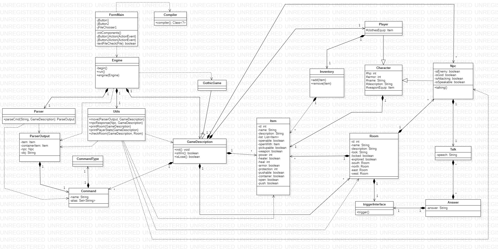

# Adventure-text Engine

# Realizzato da Giuseppe Napoletano

## 1. Introduzione

Per il corso di studi **Metodi Avanzati di Programmazione** è stato portato a termine il progetto per la realizzazione di un motore di gioco per avventure testuali. Per la sua realizzazione è stato utilizzato **Java** come linguaggio di programmazione e **Maven** come tool di automazione.

## 2. Requisiti

Il sistema deve fornire dei requisiti minimi per poter essere considerato valido. Il sistema dev'essere in grado di:
* Definire i vari elementi di un'avventura e poterla eseguire.
* Interpretare correttamente i comandi impartiti da tastiera.
* Poter eseguire diverse avventure grafiche senza dover necessariamente modificare il codice del motore.

## 3. Strutture dati (Caratteristiche tecniche)

Per implementare le diverse funzionalità del motore, sono state definite le seguenti strutture dati:
+ ***Answer***: Definisce la composizione delle risposte di un dialogo
+ ***Character***: Definisce i personaggi di un'avventura
+ ***Npc***: Sotto-classe di *Character*. Definisce i personaggi interagibili dall'utente
+ ***Player***: Sotto-classe di *Character*. Definisce le caratteristiche del protagonista dell'avventura
+ ***Command***: Definisce i comandi di gioco
+ ***Inventory***: Definisce la composizione dell'inventario del personaggio principale
+ ***Item***: Definisce la composizione degli oggetti di gioco
+ ***Room***: Definisce le caratteristiche delle stanze 
+ ***Talk***: Definisce i dialoghi possibili con i personaggi interagibili

### Answer ###

| var              | Tipo             | Valore Default | Significato                                 |
|------------------|------------------|----------------|---------------------------------------------|
| answer           | String           | null           | Testo della risposta possibile da scegliere |
| warp             | Talk             | null           | Dialogo concatenato alla risposta           |
| triggerReference | triggerInterface | null           | Evento causato dalla risposta               |

### Character ###

| var         | Tipo   | Valore Default | Significato                                |
|-------------|--------|----------------|--------------------------------------------|
| hp          | int    |                | Valore numerico punti vita del personaggio |
| armor       | int    | 0              | Valore numerico punti armatura             |
| name        | String |                | Nome del personaggio                       |
| description | String |                | Descrizione del personaggio                |
| weaponEquip | Item   | null           | Oggetto equipaggiato                       |

### Npc (estende Character) ###

| var         | Tipo    | Valore Default | Significato                                                                 |
|-------------|---------|----------------|-----------------------------------------------------------------------------|
| isEnemy     | boolean | false          | Determina se il personaggio è un nemico (I nemici rispondono agli attacchi) |
| isGod       | boolean | false          | Determina se il personaggio è in God Mode (Invulnerabile)                   |
| isAttacking | boolean | false          | Se TRUE il personaggio continuerà ad attaccare il giocatore                 |
| isSpeakable | boolean | false          | Determina se con il personaggio è possibile parlare                         |
| talk        | Talk    | null           | Set di dialogo del personaggio                                              |

### Player (estende Character) ###

| var          | Tipo      | Valore Default | Significato                                         |
|--------------|-----------|----------------|-----------------------------------------------------|
| inventory    | Inventory | new            | Instanza di inventario associata la giocatore       |
| clothesEquip | Item      | null           | Oggetto di tipo armatura equipaggiato dal giocatore |

### Command ###

| var   | Tipo        | Valore Default | Significato                                                                        |
|-------|-------------|----------------|------------------------------------------------------------------------------------|
| type  | CommandType |                | Definisce il tipo di comando                                                       |
| name  | String      |                | Definisce il nome del comando                                                      |
| alias | Set<String> |                | Definisce un set di nome alternativi da poter utilizzare per richiamare il comando |

### Inventory ###

| var  | Tipo       | Valore Default | Significato                             |
|------|------------|----------------|-----------------------------------------|
| list | List<Item> | new            | Lista di oggetti presenti in inventario |

### Item ###

| var         | Tipo       | Valore Default | Significato                                                                 |
|-------------|------------|----------------|-----------------------------------------------------------------------------|
| id          | int        |                | Identificatore univoco dell'oggetto                                         |
| name        | String     |                | Nome dell'oggetto                                                           |
| description | String     |                | Descrizione testuale dell'oggetto                                           |
| list        | List<Item> | new            | Lista di altri oggetti contenuti all'interno (se container)                 |
| openable    | boolean    | false          | Determina se l'oggetto è apribile                                           |
| openWith    | Item       | null           | Determina un'altro oggetto con cui è possibile aprire un container bloccato |
| pickupable  | boolean    | true           | Determina se è possibile raccogliere l'oggetto e aggiungerlo in inventario  |
| weapon      | boolean    | false          | Imposta l'oggetto come arma                                                 |
| power       | int        | 0              | Valore numerico del danno che può infliggere (se arma)                      |
| healer      | boolean    | false          | Indica se l'oggetto può essere assunto per modificare il parametro 'hp'     |
| heal        | int        | 0              | Valore numerico da sommare al parametro 'hp'                                |
| armor       | boolean    | false          | Determina se l'oggetto è un'armatura                                        |
| protection  | int        | 0              | Valore di protezione che l'armatura fornisce                                |
| pushable    | boolean    | pushable       | Indica se l'oggetto si può spingere                                         |
| container   | boolean    | container      | Determina se l'oggetto è un contenitore                                     |
| open        | boolean    | open           | Indica se il container è aperto                                             |
| push        | boolean    | push           | Indica se l'oggetto è stato spinto                                          |

### Room ###

| var              | Tipo             | Valore Default | Significato                                            |
|------------------|------------------|----------------|--------------------------------------------------------|
| id               | int              |                | identificatore univoco della stanza                    |
| name             | String           |                | Nome della stanza                                      |
| description      | String           |                | Descrizione testuale della stanza                      |
| look             | String           | "Vuoto"        | Descrizione estesa della stanza vista dal giocatore    |
| locked           | boolean          | false          | Indica se la stanza è bloccata, quindi inaccessibile   |
| explored         | boolean          | false          | Indica se una stanza con trigger è stata già esplorata |
| south            | Room             | null           | Associa un'altra stanza a Sud                          |
| north            | Room             | null           | Associa un'altra stanza a Nord                         |
| east             | Room             | null           | Associa un'altra stanza ad Est                         |
| west             | Room             | null           | Associa un'altra stanza ad Ovest                       |
| triggerReference | triggerInterface | null           | Associa un trigger che si attiva al visitare la stanza |
| items            | List<item>       | new            | Lista di oggetti presenti nella stanza                 |
| npc              | List<npc>        | new            | Lista di personaggi presenti nella stanza              |

### Talk ###

| var    | Tipo         | Valore Default | Significato                            |
|--------|--------------|----------------|----------------------------------------|
| speech | String       | new            | Frase del dialogo pronunciata da Npc   |
| ans    | List<Answer> | new            | Lista di risposte possibili alla frase |

### 3.1 Specifiche algebriche ###

### Inventory ###

| Specifica sintattica |                                                    |
| -------------------- | -------------------------------------------------- |
| Tipi:                | Inventario, Oggetto                                |
| Operatori:           | creaInventario()-> Inventario                      |
|                      | aggiungiOggetto(Inventario, Oggetto) -> Inventario |
|                      | rimuoviOggetto(Inventario, Oggetto) -> Inventario  |

| Osservazioni             | Costruttori di Inventory | Costruttori di Inventory                                     |
| ------------------------ | ------------------------ | ------------------------------------------------------------ |
|                          | creaInventario()         | aggiungiOggetto(i, obj)                                      |
| rimuoviOggetto(i', obj') | Error                    | if i == ^ then creaInventario() else   aggiungiOggetto(rimuoviOggetto(i ,obj)) |

| Specifica semantica                     |                                                              |
| --------------------------------------- | ------------------------------------------------------------ |
| declare i:Inventario, obj:Oggetto       |                                                              |
| rimuoviOggetto(aggiungiOggetto(i, obj)) | if i == ^ then creaInventario() else aggiungiOggetto(rimuoviOggetto(i ,obj)) |

| Specifica di restrizioni         |       |
| -------------------------------- | ----- |
| Restriction                      |       |
| rimuoviOggetto(creaInventario()) | Error |

### Player ###

| Specifica sintattica |                                      |
| -------------------- | ------------------------------------ |
| Tipi:                | Inventory, Item, int, String         |
| Operatori:           | Player(Int, String, String)-> Player |
|                      | getInventory() -> Inventory          |
|                      | getClothesEquip() -> Item            |
|                      | setClothesEquip(Item) -> Player      |

| Osservazioni      | Costruttori di Inventory    | Costruttori di Inventory           |
| ----------------- | --------------------------- | ---------------------------------- |
|                   | Player(Int, String, String) | setClothesEquip(clothesEquip)      |
| getInventory()    | Error                       | Error                              |
| getClothesEquip() | Error                       | setClothesEquip(getClothesEquip()) |

| Specifica semantica                                          |                                    |
| ------------------------------------------------------------ | ---------------------------------- |
| Declare hp:Int, name:String, description:String, inventory:Inventory, clothesEquip:Item |                                    |
| getClothesEquip(setClothesEquip(clotheEquip))                | setClothesEquip(getClothesEquip()) |

| Specifica di restrizioni                       |       |
| ---------------------------------------------- | ----- |
| Restriction                                    |       |
| getInventory(Player(hp, name, description))    | Error |
| getInventory(setClothesEquip(clothesEquip))    | Error |
| getClothesEquip(Player(hp, name, description)) | Error |

### Character

| Specifica sintattica |                                             |
| -------------------- | ------------------------------------------- |
| Tipi:                | Character, Int, String, Item                |
| Operatori:           | Character(Int, String, String) -> Character |
|                      | getName() -> String                         |
|                      | getHp() -> Int                              |
|                      | setHp(Int) -> Character                     |
|                      | getArmor() -> Int                           |
|                      | setArmor(Int) -> Character                  |
|                      | getWeaponEquip() -> Item                    |
|                      | setWeaponEquip(Item) -> Character           |
|                      | getDescription() -> String                  |

| Specifica semantica                                          | Pre e Post condizioni                                        |
| ------------------------------------------------------------ | ------------------------------------------------------------ |
| hero:Character, hp:Int, armor:Int, name:String, description:String, weaponEquip:Item |                                                              |
| Character(hp, name, description) -> hero                     | PRE : /                                                                                                              POST: hero = {hp, name, description, armor, weaponEquip} |
| getName() -> name                                            | PRE : / POST : name                                          |
| getHp() -> hp                                                | PRE : / POST : hp                                            |
| setHp(hp) -> hero                                            | PRE : 0 < hp <= 100                                                                                          POST : hp' = hp, hero = {hp', name, description, armor, weaponEquip} |
| getArmor() -> armor                                          | PRE : / POST : armor                                         |
| setArmor(armor) -> hero                                      | PRE : armor == "armatura leggera" \|\| armor == "armatura" \|\| armor == "vestiti".                                              POST : armor' = armor, hero ={hp, name, description, armor', weaponEquip} |
| getWeaponEquip() -> weaponEquip                              | PRE : /  POST : weaponEquip                                  |
| setWeaponEquip(weaponEquip) -> hero                          | PRE : weaponEquip == "spada" \|\| weaponEquip == "spada_rotta" \|\| weaponEquip == "mazza" \|\| weaponEquip == "super_spada"                         POST : weaponEquip' = weaponEquip, hero = {hp, name, description, armor, weaponEquip'} |
| getDescription() -> description                              | PRE : / POST : description                                   |

(Strumenti utilizzati)

Swing - Reflection - Lambda Exp - Compiler Runtime - File

## 4. System Design

L'architettura del sistema è stata pensata in modo da rispettare tre importanti specifiche:
- ***Riuso***
- ***Modificabilità***
- ***Portabilità***

**Riuso**: Il sistema è stato progettato per poter supportare più di una singola avventura testuale pre-programmata, consentendo di aggiungerne di nuove tramite caricamento da file. Per fare ciò le varie componenti del sistema sono state divise, permettendo un'indipendenza tra le parti che si occupano delle meccaniche di gioco e l'avventura stessa.

**Modificabilità**: E' possibile in questo modo permettere modifiche alle componenti interessate in caso di cambiamento dei requisiti, rendendone più facile l'aggiornamento e la predisposizione all'essere adattato per sviluppare altre soluzioni. Una modifica ad un componente non deve affliggere indirettamente l'intero sistema.

**Portabilità**: Utilizzando Java come linguaggio di programmazione è possibile l'utilizzo del software su diversi sistemi senza dover intervenire su alcun componente. 

Dal diagramma del sistema è possibile notare la suddivisione dei componenti in tre aree identificate come:
- *Interfaccia utente*
- *Motore di gioco*
- *Avventura testuale*

## 5. OO Design
Diagramma delle classi:

## 6. Manuale dell'utente
All'avvio dell'applicazione verrà mostrato all'utente un menù da cui sarà possibile scegliere l'avventura da eseguire.

Saranno presenti, per questa versione del motore, due opzioni: *'Play GothicGame'* e *'Load from file'*.
Selezionando la prima opzione verrà eseguita l'avventura di default pre-caricata nell'engine.
Immagine di gioco:

Altrimenti con la seconda opzione è possibile caricare un'avventura testuale personalizzata.
E' possibile riscontrare degli errori durante il caricamento da file. Il motore accetta in input file di testo *.txt* o file classe *.java* e nel caso venga fornito un formato non riconosciuto, verrà restituito un errore.

Una volta selezionato un file nel formato corretto, verrà effettuato un controllo sul codice. In caso vengano rilevate inesattezze, un messaggio di errore sarà mostrato e nella console di gioco verranno forniti ulteriori dettagli come il tipo di errore e la parte di codice affetta.

*(Messaggio di errore)*

*(Dettagli errore)*

---
### 6.1. Creare file avventura ###

Per creare una nuova avventura testuale importabile nell'engine di gioco è possibile utilizzare una classe java (*.java*) o un file di testo con codice java (*.txt*).

Le regole per programmare la propria avventuara sono identiche per entrambi i metodi.
Nel file è importante definire il package a cui fare riferimento che sarà:
+ **``package di.uniba.map.game.games;``**

Per utilizzare appieno tutte le funzionalità è importante importare le seguenti classi:

**N.B. Queste sono fondamentali per la corretta compilazione del gioco** 
+ **``import di.uniba.map.game.engine.GameDescription;``**
+ **``import di.uniba.map.game.type.*;``**

E' comunque possibile importare ulteriori classi per aggiungere nuove funzionalità. Queste sono, ad esempio, le classi aggiuntive utilizzate per realizzare il file gioco di esempio:
+ ``import java.util.List;``
+ ``import java.util.Scanner;``
+ ``import java.util.stream.Collectors;``

Tutte le definizioni del gioco devo essere incluse dentro una classe che deve avere questa precisa definizione:
+ **``public class Game extends GameDescription { }``**

All'interno devono essere definiti i tre metodi fondamentali per il corretto funzionamento del gioco ovvero: 
+ public void ***init()***: metodo che definisce tutte le istanze del gioco quali stanze, oggetti, eccetera.
+ public boolean ***isWin()***: metodo che serve a definire le condizioni di vittoria. Se **TRUE** si vince la partita
+ public boolean ***isLose()***: metodo che serve a definire le condizioni di sconfitta. Se **TRUE** si perde la partita.

Fare riferimento al paragrafo 3 per le strutture dati e metodi utilizzabili.
